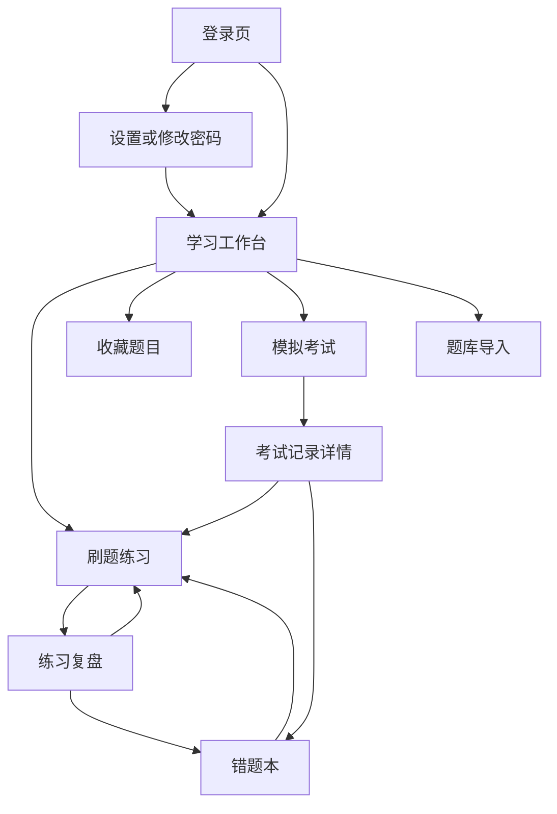
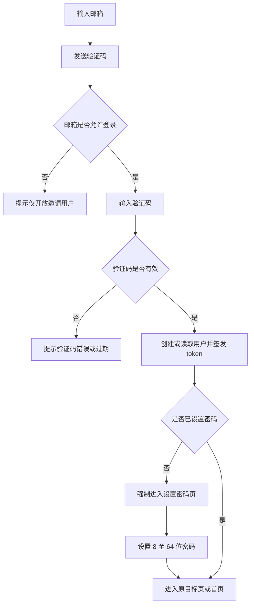
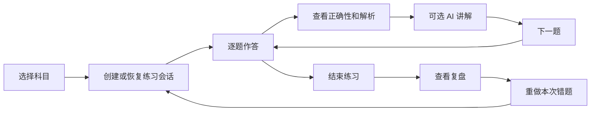
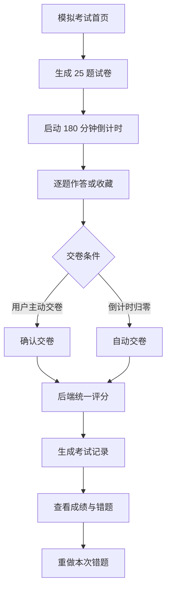

# AI408 前端产品需求文档

## 0. 文档信息

| 项目   | 内容                               |
| ---- | -------------------------------- |
| 产品名称 | AI408 刷题系统                       |
| 文档版本 | V1.0                             |
| 文档类型 | 前端功能 PRD                         |
| 产品形态 | Web 应用，兼容桌面端和移动端浏览器              |
| 目标版本 | 当前已实现功能的产品化与上线版本                 |
| 后端仓库 | `D:\02code\02IdeaProjects\AI408` |
| 前端仓库 | `D:\02code\AI408-front`          |
| 文档用途 | 产品确认、Stitch 原型设计、前端实现、前后端联调、测试验收 |

### 0.1 文档原则

本文档以功能和业务闭环为主，不限定具体色彩、字体、阴影、圆角或品牌视觉。Stitch 可在不改变信息层级、操作流程和业务规则的前提下完成原型设计。

功能优先级定义：

| 优先级 | 定义                         |
| --- | -------------------------- |
| P0  | 上线必须具备，缺失会阻断核心使用流程         |
| P1  | 建议在当前版本补齐，可明显改善完整性，但不阻断主流程 |
| P2  | 后续版本候选，不纳入当前上线验收           |

### 0.2 当前产品边界

当前版本围绕以下闭环展开：

1. 用户通过邮箱验证码或邮箱密码登录。
2. 首次登录用户设置密码。
3. 用户选择科目，进行刷题或背题。
4. 用户提交答案并查看标准解析或 AI 讲解。
5. 错题自动进入错题本，重点题可加入收藏。
6. 用户结束练习并查看复盘，随后重做错题。
7. 用户参加模拟考试并查看考试记录。
8. 管理员通过文件批量导入公共题库。

当前版本不包含社区、排行榜、付费、课程、消息中心、独立题库搜索页、在线题目编辑器等功能。

---

## 1. 产品背景

408 考研复习具有科目多、知识点分散、持续练习周期长的特点。用户不仅需要完成题目，还需要持续追踪错题、收藏重点题、复盘薄弱点，并通过模拟考试检验阶段成果。

AI408 的定位不是单纯的题目浏览器，而是个人学习工作台：题库对所有已登录用户共享，用户的作答状态、错题、收藏、练习会话和考试记录相互隔离。

## 2. 产品目标

### 2.1 核心目标

- 让用户登录后能快速开始或继续一组 408 练习。
- 建立“练习 -> 即时反馈 -> 复盘 -> 错题重做”的学习闭环。
- 支持刷题、背题、错题专项和模拟考试等不同学习方式。
- 通过标准解析、题目图片和 AI 讲解降低理解难度。
- 确保多用户之间学习数据完全隔离，公共题库正常共享。
- 为管理员提供可追踪、可纠错的题库批量导入能力。

### 2.2 上线成功标准

- 受邀用户可以完成邮箱验证码登录、设置密码和密码登录。
- 新用户即使没有任何用户题目状态，也能看到科目并创建练习。
- 普通练习、错题重做和模拟考试均可从开始完整走到结果页。
- 用户切换后不会显示上一账号的当前题目、练习会话、错题或统计。
- 管理员可以完成模板下载、题库上传、状态查询和错误文件下载。
- 所有主要功能在 375px 手机宽度和桌面端均可操作。

### 2.3 非目标

- 当前版本不追求开放注册后的大规模增长能力。
- 当前版本不提供复杂的知识图谱和学习路径推荐。
- 当前版本不提供题目评论、用户讨论和社交关系。
- 当前版本不提供会员、订单或付费内容。

---

## 3. 目标用户与角色

### 3.1 普通学员

典型特征：

- 正在准备计算机专业 408 统考。
- 需要按数据结构、计算机组成原理、操作系统、计算机网络进行练习。
- 需要记录个人进度、错题、收藏和考试成绩。
- 可能在电脑和手机之间切换使用。
- 日常希望使用密码登录，首次使用或忘记密码时使用验证码登录。

核心诉求：

- 快速进入练习。
- 清楚知道当前进度和正确率。
- 找到并反复处理薄弱题目。
- 在不理解答案时获得进一步讲解。
- 通过模拟考试了解阶段水平。

### 3.2 题库管理员

典型特征：

- 负责题目整理和系统题库维护。
- 需要一次导入多道题目及题目图片。
- 需要知道导入成功数、失败数和具体失败原因。

管理员继承普通学员的全部权限，并额外拥有题库导入权限。

### 3.3 游客

游客只能访问登录页。访问其他页面时应被引导到登录页，并在登录完成后返回原目标页面。

### 3.4 权限矩阵

| 功能        | 游客  | 普通学员    | 管理员     |
| --------- | --- | ------- | ------- |
| 邮箱验证码发送   | 可用  | 无需使用    | 无需使用    |
| 邮箱验证码登录   | 可用  | 可用于重置密码 | 可用于重置密码 |
| 邮箱密码登录    | 可用  | 可用      | 可用      |
| 设置/修改密码   | 不可用 | 可用      | 可用      |
| 学习工作台     | 不可用 | 可用      | 可用      |
| 刷题/背题     | 不可用 | 可用      | 可用      |
| AI 讲解     | 不可用 | 可用      | 可用      |
| 练习复盘      | 不可用 | 可用      | 可用      |
| 错题本/收藏    | 不可用 | 可用      | 可用      |
| 模拟考试/考试记录 | 不可用 | 可用      | 可用      |
| 题库导入      | 不可用 | 不可用     | 可用      |

---

## 4. 核心概念与数据边界

### 4.1 公共题库

题目、科目、题目图片、标准答案和标准解析属于公共内容。所有通过权限校验的已登录用户都可以使用同一套题库。

当前科目编码：

| 编码   | 科目          |
| ---- | ----------- |
| DS   | 数据结构        |
| CO   | 计算机组成原理     |
| OS   | 操作系统        |
| CN   | 计算机网络       |
| MOCK | 整套模拟/综合抽题入口 |

科目列表必须以后端返回为准，不能只在前端硬编码上述科目。

### 4.2 用户私有数据

以下数据必须通过 `userId` 隔离：

- 已答题数、正确数和学习时长。
- 每道题的作答状态。
- 错题本状态和错题时间。
- 收藏状态、收藏等级和收藏时间。
- 题目个人笔记。
- 练习会话、会话题目和复盘结果。
- 模拟考试记录和考试答案。
- 错题自动移除设置。

新用户对应的用户题目状态记录可以为 0 条，这不应影响公共题库展示或练习创建。

### 4.3 题型

| 题型值        | 产品名称    | 作答方式         |
| ---------- | ------- | ------------ |
| `single`   | 单选题     | 选择一个选项       |
| `multiple` | 多选题     | 选择一个或多个选项后提交 |
| `essay`    | 步骤题/综合题 | 按步骤标记是否完成    |

### 4.4 练习模式

| 模式                | 说明                                 |
| ----------------- | ---------------------------------- |
| 刷题模式 `sequence`   | 用户先作答，提交后查看正确性和解析                  |
| 背题模式 `memorize`   | 直接查看正确答案和解析，用于记忆与理解                |
| 错题本练习 `wrongBook` | 从当前用户错题本创建专项练习                     |
| 收藏练习 `favorites`  | 后端已支持从当前用户收藏题创建练习，前端完整入口列为 P1      |
| 指定题目练习            | 使用明确的 `questionIds` 重做本次错题、今日错题或单题 |

### 4.5 收藏等级

| 数值  | 含义   |
| --- | ---- |
| 0   | 未收藏  |
| 1   | 重要   |
| 2   | 非常重要 |

当前考试页支持收藏/取消收藏，收藏列表支持按等级统计。练习页的收藏入口和收藏等级修改属于 P1 补齐项。

---

## 5. 信息架构

### 5.1 页面清单

| 页面编号  | 页面名称     | 路由                  | 权限  | 优先级 |
| ----- | -------- | ------------------- | --- | --- |
| PG-01 | 登录页      | `/login`            | 公开  | P0  |
| PG-02 | 设置/修改密码页 | `/account/password` | 已登录 | P0  |
| PG-03 | 学习工作台    | `/`                 | 已登录 | P0  |
| PG-04 | 刷题练习页    | `/practice`         | 已登录 | P0  |
| PG-05 | 练习复盘页    | `/review`           | 已登录 | P0  |
| PG-06 | 错题本页     | `/mistakes`         | 已登录 | P0  |
| PG-07 | 收藏题目页    | `/favorites`        | 已登录 | P0  |
| PG-08 | 模拟考试页    | `/exam`             | 已登录 | P0  |
| PG-09 | 考试记录详情页  | `/exam/records/:id` | 已登录 | P0  |
| PG-10 | 题库导入页    | `/admin/import`     | 管理员 | P0  |

### 5.2 全局导航

已登录用户的全局导航包含：

- 首页
- 刷题
- 考试
- 复盘
- 错题本
- 收藏
- 当前账户信息
- 退出登录

管理员增加“题库导入”入口。

未登录状态只保留品牌入口和登录入口。首次登录但未设置密码时，只允许进入密码设置页和执行退出。

### 5.3 页面关系



---

## 6. 全局功能需求

### 6.1 登录状态管理

| 编号        | 需求                                            |
| --------- | --------------------------------------------- |
| G-AUTH-01 | 登录成功后保存 access token、refresh token、过期时间和用户信息。 |
| G-AUTH-02 | 请求返回未登录或 token 过期时，前端优先使用 refresh token 刷新。   |
| G-AUTH-03 | 刷新成功后更新本地 token 并重试原请求。                       |
| G-AUTH-04 | 刷新失败时清理登录状态，跳转登录页。                            |
| G-AUTH-05 | 登录页收到 `redirect` 参数时，登录完成后返回原目标页面。            |
| G-AUTH-06 | 已登录用户访问登录页时跳转首页。                              |
| G-AUTH-07 | 用户 `hasPassword=false` 时，强制跳转密码设置页。           |
| G-AUTH-08 | 非管理员访问管理员页面时跳转首页，并可提示无权限。                     |

### 6.2 用户切换与本地缓存

前端本地保存两类状态：

- 登录会话：token 和当前用户信息。
- 学习 UI 状态：当前科目、当前练习会话、当前题目、练习模式、待创建练习请求。

出现以下情况时必须清空学习 UI 状态：

- 登录用户发生变化。
- 用户主动退出登录。
- 管理员成功导入新题库。
- 用户明确点击“新开一组题”。

清空后默认值：

| 字段      | 默认值        |
| ------- | ---------- |
| 当前科目    | `CN`       |
| 当前练习会话  | 空          |
| 当前题目    | 空          |
| 练习模式    | `sequence` |
| 待执行练习请求 | 空          |

### 6.3 通用请求状态

所有页面和操作至少支持以下状态：

| 状态   | 前端要求              |
| ---- | ----------------- |
| 初始   | 不展示上一次请求的错误信息     |
| 加载中  | 展示明确加载状态，防止重复提交   |
| 成功   | 更新当前页面数据和关联统计     |
| 空数据  | 说明当前没有数据，并提供下一步操作 |
| 业务失败 | 展示后端返回的可读错误信息     |
| 网络失败 | 保留用户输入或本地答案，提供重试  |
| 无权限  | 隐藏无权限入口并阻止页面访问    |
| 登录失效 | 尝试刷新，失败后返回登录页     |

### 6.4 通用危险操作

以下操作执行前必须确认：

- 清空错题本。
- 清空收藏。
- 结束仍有未答题的练习。
- 主动交卷。
- 离开进行中的考试。
- 使用“替换题库”方式导入。

确认信息必须写明操作对象和后果，不能只显示“是否确定”。

---

## 7. 核心业务流程

### 7.1 首次登录与设置密码



### 7.2 日常密码登录

1. 用户输入邮箱和密码。
2. 前端提交密码登录请求。
3. 邮箱不存在、未设置密码或密码错误统一提示“登录失败”。
4. 登录成功后保存会话。
5. 如果 URL 中存在原目标路由，则返回该路由，否则进入首页。

### 7.3 普通练习闭环



### 7.4 错题专项练习

用户可以从以下入口创建指定题目练习：

- 错题本全部错题。
- 今日新增错题。
- 错题列表中的单道题。
- 最近一次练习中的错题。
- 某次模拟考试中的错题。

创建专项练习前，前端写入待执行练习请求并清空当前普通练习会话。练习页读取该请求后创建新会话，成功后立即清除待执行请求，防止刷新重复创建。

### 7.5 模拟考试



### 7.6 管理员导入题库

1. 管理员进入题库导入页并下载最新模板。
2. 管理员选择 Excel/CSV 文件。
3. 管理员选择追加或替换方式。
4. 前端上传文件并获得导入任务 ID。
5. 前端每 2 秒查询任务状态。
6. 状态为成功或失败时停止轮询。
7. 成功后展示总数、成功数和失败数，并清理旧练习会话。
8. 失败且有错误文件时，允许下载错误文件修正后重试。

---

## 8. 页面详细需求

## PG-01 登录页

### 8.1 页面目标

提供密码登录和验证码登录。密码登录用于日常使用；验证码登录用于首次登录和忘记密码。

### 8.2 入口条件

- 游客主动访问登录页。
- 游客访问受保护页面后被路由守卫跳转。
- token 和 refresh token 均失效后被跳转。
- 用户主动退出后进入登录页。

### 8.3 功能模块

| 模块     | 内容               | 优先级 |
| ------ | ---------------- | --- |
| 登录方式切换 | 密码登录、验证码登录       | P0  |
| 邮箱输入   | 两种方式共用           | P0  |
| 密码输入   | 密码登录显示           | P0  |
| 验证码输入  | 验证码登录显示          | P0  |
| 发送验证码  | 发送状态和倒计时         | P0  |
| 登录提交   | 根据当前模式调用对应接口     | P0  |
| 忘记密码入口 | 从密码模式切换到验证码模式    | P0  |
| 结果提示   | 邀请限制、验证码错误、登录失败等 | P0  |

### 8.4 字段规则

| 字段  | 必填      | 规则                         |
| --- | ------- | -------------------------- |
| 邮箱  | 是       | 合法邮箱格式，最长 120 字符，提交前去除首尾空格 |
| 密码  | 密码模式必填  | 最长 64 字符，不在前端日志或本地存储中保存    |
| 验证码 | 验证码模式必填 | 最长 12 字符，当前邮件验证码通常为 6 位    |

### 8.5 操作规则

1. 默认展示密码登录。
2. 切换登录方式时保留邮箱，清空密码或验证码错误提示。
3. 邮箱为空或格式错误时不能发送验证码。
4. 验证码发送中禁用发送按钮。
5. 发送成功后启动 60 秒倒计时；倒计时内禁止重复发送。
6. 登录提交中禁用登录按钮，防止重复请求。
7. 登录成功后写入认证状态。
8. 登录用户与本地上一用户不同，则清空学习 UI 缓存。
9. 登录成功但 `hasPassword=false` 时进入密码设置页。
10. 密码登录失败统一显示“登录失败”，不能区分邮箱不存在、未设置密码或密码错误。

### 8.6 页面状态

| 状态     | 页面表现                |
| ------ | ------------------- |
| 初始     | 密码登录激活，字段为空         |
| 验证码发送中 | 按钮显示发送中并禁用          |
| 验证码已发送 | 提示有效期，显示倒计时         |
| 登录中    | 登录按钮显示处理中并禁用        |
| 邀请限制   | 显示“当前仅开放邀请用户登录”     |
| 验证码错误  | 显示错误，保留邮箱，允许重新输入验证码 |
| 邮件发送失败 | 显示后端错误，允许重试         |
| 密码登录失败 | 显示统一登录失败提示          |

### 8.7 验收标准

- 两种登录方式可正常切换并分别提交。
- 验证码按钮不会被连续点击产生多次请求。
- 登录成功后能正确返回原目标页面。
- 非白名单邮箱在邀请制下不能获取验证码或登录。
- 页面刷新后不恢复密码和验证码明文。

## PG-02 设置/修改密码页

### 8.8 页面目标

完成首次密码设置、日常修改密码和验证码登录后的密码重置。

### 8.9 功能模块

| 模块    | 首次设置      | 已有密码             |
| ----- | --------- | ---------------- |
| 场景说明  | 显示必须先设置密码 | 显示修改密码说明         |
| 当前密码  | 不显示       | 显示，可根据登录方式决定是否必填 |
| 新密码   | 显示        | 显示               |
| 确认新密码 | 显示        | 显示               |
| 保存    | 显示        | 显示               |

### 8.10 业务规则

1. 新密码长度必须为 8-64 位。
2. 新密码和确认密码必须一致。
3. 用户从未设置过密码时，不要求当前密码。
4. 已有密码且当前会话来自密码登录时，必须输入正确当前密码。
5. 当前会话来自验证码登录时，可不输入当前密码直接重置。
6. 保存成功后更新认证状态中的 `user.hasPassword=true`。
7. 首次设置成功后进入原目标路由或首页。
8. 修改成功后当前 access token 仍可继续使用；不强制退出当前会话。

### 8.11 状态与验收

- 输入不合法时在前端阻止提交并指出具体字段。
- 保存失败时保留输入内容，但当前密码字段可按安全策略清空。
- 保存中不能重复提交。
- 首次登录用户不能通过修改 URL 绕过该页面进入其他业务页。
- 用户可以退出登录，不应被强制困在密码设置页。

## PG-03 学习工作台

### 8.12 页面目标

汇总当前用户的学习状态，并提供进入各学习功能的统一入口。

### 8.13 数据模块

| 模块   | 字段/内容                                  |
| ---- | -------------------------------------- |
| 用户信息 | 昵称，缺失时依次使用邮箱、手机号、“同学”                  |
| 当前科目 | 科目名称、科目题量                              |
| 全局进度 | `progressRate`                         |
| 答题数据 | `answeredCount`、`correctCount`、计算后的正确率 |
| 错题数据 | `wrongCount`、`todayWrongCount`         |
| 收藏数据 | `favoriteCount`、`todayFavoriteCount`   |
| 学习时长 | `sessionSeconds` 转换为分钟或时分              |
| 科目列表 | 科目名称、简称、总题量、已做数、错题数                    |

### 8.14 功能模块

1. 学习概览。
2. 当前科目摘要。
3. 继续练习或开始练习。
4. 新开一组题。
5. 查看最近复盘。
6. 下一步行动入口：练习、复盘、错题本。
7. 科目切换。
8. 功能入口：刷题/背题、复盘、错题本、收藏、模拟考试。
9. 管理员题库导入入口。

### 8.15 交互规则

1. 页面初始化并行加载科目和学习摘要。
2. 本地当前科目仍存在于后端科目列表时继续使用。
3. 本地科目不存在时选择后端返回的第一个科目。
4. 有当前练习会话时，主操作显示“继续练习”。
5. 无当前练习会话时，主操作显示“开始练习”。
6. “新开一组题”必须清空当前会话后进入练习页。
7. 科目切换写入本地学习状态，练习页沿用该科目。
8. 管理员入口只对 `role=admin` 展示。

### 8.16 页面状态

| 状态   | 要求                        |
| ---- | ------------------------- |
| 加载中  | 科目和统计区域显示加载状态             |
| 正常   | 展示真实统计，0 值应显示为 0          |
| 无科目  | 提示题库暂无科目；管理员可进入导入，普通用户可刷新 |
| 加载失败 | 展示错误和重试，不清空已确认的用户身份       |

### 8.17 验收标准

- 当前用户无任何题目状态时，仍能看到公共科目和题量。
- 科目切换后进入练习页使用正确科目。
- 切换账号后所有统计来自新账号。
- 首页快捷入口全部能到达对应页面。

## PG-04 刷题练习页

### 8.18 页面目标

支持连续答题、背题、答案反馈、AI 讲解和专项错题重做。

### 8.19 页面模块

| 模块     | 内容                | 优先级 |
| ------ | ----------------- | --- |
| 模式切换   | 刷题、背题             | P0  |
| 科目切换   | 动态科目列表            | P0  |
| 会话控制   | 创建、恢复、结束          | P0  |
| 题目信息   | 题号、总数、科目、题型、新题型标记 | P0  |
| 题目内容   | 标题、题干、题目图片        | P0  |
| 作答区    | 单选、多选、步骤题         | P0  |
| 答案反馈   | 正误、用户答案、正确答案、标准解析 | P0  |
| AI 讲解  | 流式讲解、失败重试         | P0  |
| 翻题     | 上一题、下一题           | P0  |
| 题号导航   | 当前、未答、正确、错误状态     | P0  |
| 练习统计   | 已答、正确、错误、进度       | P0  |
| 重做当前错题 | 使用当前会话错题创建新练习     | P0  |
| 收藏当前题  | 收藏、取消收藏、选择等级      | P1  |

### 8.20 会话创建规则

1. 页面优先检查是否存在待执行练习请求。
2. 存在待执行请求时，按 `mode`、`questionIds`、`limit`、`subjectCode` 创建专项会话。
3. 专项会话创建成功后清空待执行请求。
4. 不存在待执行请求但本地存在 `currentSessionId` 时，尝试恢复会话。
5. 会话不存在、已失效或无法恢复时，清理本地会话并创建新会话。
6. 普通会话默认使用当前科目，默认最多 20 题。
7. 普通科目按该科目抽题；科目为空或为 `MOCK` 时可从全题库抽题。
8. 普通抽题顺序由后端随机处理。

### 8.21 模式切换规则

- 刷题和背题共用题目来源，但展示和提交行为不同。
- 切换模式时创建新的练习会话，避免两种模式状态混用。
- 切换模式前清空当前答案缓存、结果缓存、步骤缓存和 AI 内容。
- 当前模式写入本地学习状态，刷新后可以恢复。

### 8.22 科目切换规则

- 切换科目时清空当前练习会话并创建新会话。
- 清空当前题目的答案缓存和 AI 讲解。
- 当前科目写入本地学习状态。
- 当前科目无题时显示无题状态，不能无限重复创建会话。

### 8.23 单选题规则

1. 刷题模式下点击一个选项即提交该答案。
2. 提交中禁用所有选项。
3. 提交成功后展示正确/错误状态、正确答案和解析。
4. 提交失败时保留当前选择，允许重试。
5. 已提交题目不可重复更改答案。
6. 背题模式下直接标出正确答案并展示解析，不提交普通答案。

### 8.24 多选题规则

1. 用户可以切换一个或多个选项。
2. 至少选择一个选项后“提交答案”可用。
3. 提交时按选项 key 排序后发送。
4. 提交成功后锁定选择并展示答案反馈。
5. 提交失败时保留全部选择。
6. 背题模式直接标出全部正确选项。

### 8.25 步骤题规则

1. 每个步骤独立显示“未完成/已完成”。
2. 刷题模式允许逐项切换完成状态，并同步后端。
3. 所有步骤完成后，题目状态更新为已完成。
4. 步骤数量必须与后端题目步骤一致。
5. 背题模式展示步骤内容，不要求用户提交完成状态。

### 8.26 题目图片规则

- `stemImageUrl` 非空时显示题图。
- 图片按原比例完整展示，不裁切题目内容。
- 用户可以打开原图查看。
- 图片加载失败不能阻断文字题干和作答。
- 图片 URL 为空时不保留无意义占位。

### 8.27 答案反馈规则

刷题模式在提交后显示：

- 回答正确或回答错误。
- 用户答案。
- 正确答案。
- 标准解析；无解析时显示“暂无解析”。
- 错误答案提交后，后端将该题加入用户错题本。

背题模式直接显示：

- 正确答案。
- 标准解析。
- “背题模式：直接看答案”的模式说明。

### 8.28 AI 讲解规则

1. AI 讲解请求包含当前 `sessionId`、`questionId` 和用户答案。
2. 普通题调用文本模型；有题图时后端可调用视觉模型。
3. 前端通过 SSE 接收 `delta`、`done`、`error` 事件。
4. `delta` 内容按顺序追加，不覆盖已有文本。
5. 生成中禁止重复发起同一请求。
6. 切题、切换科目、切换模式时清空上一题 AI 内容。
7. AI 调用失败时保留标准解析并提供重新生成入口。

### 8.29 题号导航与进度

- 题号导航展示会话中的全部题目。
- 当前题、未答、正确和错误必须有不同状态。
- 点击题号切换当前题。
- 上一题在第一题时禁用，下一题在最后一题时禁用。
- 进度计算为已答题数除以总题数。
- 页面持续显示已答、正确和错误数量。

### 8.30 结束练习

1. 用户点击“结束并复盘”。
2. 存在未答题时应提示未答数量并确认。
3. 确认后调用结束会话接口。
4. 后端记录练习时长、正确数、错误数和正确率。
5. 成功后进入练习复盘页，保留该会话 ID 用于读取复盘。
6. 已结束会话不能继续提交答案。

### 8.31 空状态和异常

| 场景      | 处理                   |
| ------- | -------------------- |
| 当前科目无题  | 提示无可练习题目，提供切换科目和返回首页 |
| 管理员遇到无题 | 额外提供题库导入入口           |
| 会话不存在   | 清除失效会话，尝试创建新会话       |
| 会话已结束   | 进入复盘或新建会话，不允许继续提交    |
| 题目加载失败  | 保留题号和会话，提供重试         |
| 答案提交失败  | 保留本地答案，不自动跳题         |
| AI 失败   | 不影响标准答案和解析，允许重试      |

### 8.32 验收标准

- 三类题型在刷题模式均可完成提交。
- 背题模式直接显示答案且不出现错误的答题结果。
- 刷新页面后可以恢复当前会话和题目。
- 题目切换后 AI 内容不会串题。
- 错题重做请求只包含指定题目。
- 普通用户无题时不会看到无权限的管理员入口。

## PG-05 练习复盘页

### 8.33 页面目标

展示最近练习的结果、薄弱点和错题详情，并引导用户继续练习或重做错题。

### 8.34 功能模块

| 模块   | 内容                 |
| ---- | ------------------ |
| 结果结论 | 根据有无练习、有无错题生成结果文案  |
| 本次数据 | 正确率、用时、已答数、错题数     |
| 全局数据 | 全局进度、当前错题总数        |
| 薄弱点  | 从错题标签中提取的薄弱知识点     |
| 科目统计 | 各科正确数和错误数          |
| 错题详情 | 题干、图片、用户答案、正确答案、解析 |
| 后续操作 | 重做本次错题、进入错题本、继续练习  |

### 8.35 业务规则

1. 页面先加载用户学习摘要。
2. 存在当前练习会话时加载该会话复盘。
3. 无当前会话时展示“还没有可复盘的练习记录”。
4. 本次没有错题时不展示重做按钮，显示完成状态。
5. 本次有错题时可展开错题详情。
6. “重做本次错题”使用 `wrongQuestionIds` 创建指定题目练习。
7. 重做前清空当前练习会话并切换为刷题模式。

### 8.36 错题详情

每道错题展示：

- 原题序号。
- 科目、题型、新题型标记。
- 标题、题干、题目图片。
- 单选/多选题的选项和用户选择。
- 步骤题的步骤及用户完成状态。
- 用户答案、正确答案和标准解析。

### 8.37 状态与验收

- 无练习记录时提供开始练习入口。
- 无错题时提供继续练习入口。
- 加载失败时显示错误和重试，不把失败显示成 0 分。
- 重做本次错题后，新会话题目数量和错题 ID 一致。

## PG-06 错题本页

### 8.38 页面目标

集中查看和重做当前用户的错题，并配置错题自动移除规则。

### 8.39 功能模块

| 模块          | 内容                 | 优先级 |
| ----------- | ------------------ | --- |
| 错题统计        | 错题总数、今日错题、已做题数、错题率 | P0  |
| 全部错题练习      | 从错题本创建练习           | P0  |
| 今日错题练习      | 按今日错题 ID 创建练习      | P0  |
| 单题重做        | 指定一个题目创建练习         | P0  |
| 自动移除开关      | 控制答对后是否移出错题本       | P0  |
| 自动移除阈值      | 答对 1 次或 3 次        | P0  |
| 错题列表        | 标题、科目、标签、错题时间      | P0  |
| 清空错题本       | 清除当前用户全部错题         | P0  |
| 分页/加载更多     | 当前接口支持分页，页面完整翻页    | P1  |
| 科目/题型/关键词筛选 | 后端已支持筛选参数          | P1  |

### 8.40 统计规则

- 错题总数：当前仍在错题本中的题目数量。
- 今日错题：当天新增进入错题本的数量。
- 已做题数：当前用户已经作答过的题目数量。
- 错题率：错题总数占已做题数的百分比；已做题数为 0 时显示 0%。

### 8.41 自动移除规则

1. 默认阈值为答对 1 次。
2. 用户可关闭自动移除，关闭后题目一直保留，直到手动清理。
3. 开启后只允许选择 1 次或 3 次。
4. 修改设置后立即调用用户资料更新接口。
5. 保存中禁用开关和阈值选择。
6. 保存成功后更新认证状态中的用户设置。
7. 保存失败时恢复修改前状态并显示错误。

### 8.42 练习入口规则

- 全部错题练习：`mode=wrongBook`，题量至少覆盖当前错题数。
- 今日错题练习：传入 `todayWrongQuestionIds`。
- 单题重做：传入一个 `questionId`，题量为 1。
- 错题数为 0 时禁用对应练习入口。

### 8.43 清空规则

1. 点击清空后显示确认。
2. 确认文案说明题目将从当前错题列表移除。
3. 取消时不调用接口。
4. 成功后重新加载列表、统计和用户摘要。
5. 失败时保留当前列表并显示错误。

### 8.44 状态与验收

- 无错题时显示空状态和“继续刷题”入口。
- 今日错题为 0 时今日练习入口不可用。
- 切换自动移除策略后刷新页面仍保持设置。
- 用户 A 的错题与设置不会出现在用户 B 的页面。

## PG-07 收藏题目页

### 8.45 页面目标

展示当前用户收藏的重点题目和收藏等级统计。

### 8.46 功能模块

| 模块      | 内容                      | 优先级 |
| ------- | ----------------------- | --- |
| 错题/收藏切换 | 在错题本和收藏页之间切换            | P0  |
| 收藏统计    | 总数、重要、非常重要、当前页数量        | P0  |
| 收藏列表    | 标题、科目、收藏等级、收藏时间         | P0  |
| 同步数据    | 重新请求收藏列表                | P0  |
| 清空收藏    | 清除当前用户全部收藏              | P0  |
| 收藏题练习   | 以 `mode=favorites` 创建练习 | P1  |
| 取消单题收藏  | 将等级更新为 0                | P1  |
| 修改收藏等级  | 在 1 和 2 之间切换            | P1  |
| 分页和筛选   | 接入后端分页与筛选参数             | P1  |

### 8.47 业务规则

1. 默认请求第 1 页，每页 20 条。
2. 收藏总数使用接口 `recordCount`。
3. 收藏等级统计必须基于全部结果；当前仅按当前页计算时需明确为“当前页重要数”，完整统计列为 P1。
4. 列表中收藏等级应转换为“重要”或“非常重要”，不能只展示数字。
5. 清空收藏前需要确认。
6. 清空成功后刷新收藏列表和首页摘要。
7. 收藏为空时显示空状态并提供开始刷题或开始考试入口。

### 8.48 验收标准

- 收藏页只显示当前用户的收藏。
- 点击同步后能看到其他页面刚产生的收藏变化。
- 清空取消时数据不变，确认后列表变为空。
- 接口失败时不能将错误误显示成“暂无收藏”。

## PG-08 模拟考试页

### 8.49 页面目标

提供限时模拟考试、统一交卷评分和考试历史记录。

该路由包含两个互斥状态：考前/历史状态、考试进行中状态。

### 8.50 考前与历史模块

| 模块   | 内容                         |
| ---- | -------------------------- |
| 考试规则 | 180 分钟、默认 25 题、统一交卷、离开视为放弃 |
| 开始考试 | 生成试卷并启动计时                  |
| 考试记录 | 提交时间、分数、总题数、已答、正确、错误       |
| 记录入口 | 点击进入考试记录详情                 |

### 8.51 试卷生成规则

1. 点击开始考试调用生成试卷接口，当前前端固定请求 25 题
2. 题目从可用公共题库中生成。
3. 试卷返回 `paperId`、考试时长、题目总数、当前题和题目列表。
4. 生成中禁用开始按钮。
5. 生成失败时停留考前状态并允许重试。

### 8.52 考试进行中模块

| 模块   | 内容             |
| ---- | -------------- |
| 倒计时  | 从 180 分钟递减至 0  |
| 题目信息 | 题号、科目、题型、新题型标记 |
| 题目内容 | 标题、题干、题目图片     |
| 作答区  | 单选、多选、步骤题      |
| 收藏   | 收藏或取消收藏当前题     |
| 翻题   | 上一题、下一题、题号导航   |
| 答题进度 | 已答数量、未答数量      |
| 交卷   | 主动交卷和自动交卷      |

### 8.53 考试作答规则

- 单选题选择一个选项，可在交卷前修改。
- 多选题可选择或取消多个选项，可在交卷前修改。
- 步骤题逐项标记完成状态。
- 考试进行中不调用单题判分接口。
- 考试进行中不展示正确答案、标准解析或 AI 讲解。
- 答案暂存在当前页面内存中，当前版本不支持刷新后恢复。
- 题号导航显示当前题、已答和未答状态。

### 8.54 收藏规则

1. 点击收藏时将等级设为 1。
2. 点击取消收藏时将等级设为 0。
3. 收藏操作立即同步后端用户题目状态。
4. 收藏失败不能影响当前考试答案。

### 8.55 计时与交卷规则

1. 试卷生成成功后使用后端返回的 `durationSeconds` 启动倒计时。
2. 页面展示剩余时、分、秒。
3. 倒计时归零时自动交卷。
4. 主动交卷前显示确认，并建议展示未答题数量。
5. 提交数据包含全部题目 ID、已用时和每题答案/步骤状态。
6. 后端统一计算分数、正确数和错误数。
7. 交卷成功后清理当前考试草稿、刷新考试记录并进入详情页。
8. 交卷失败时保留当前试卷、答案和错误提示，不清空草稿。
9. 自动交卷失败时停止重复自动提交，并提供手动重试。

### 8.56 离开考试规则

- 用户通过站内路由离开时弹出确认。
- 用户关闭或刷新浏览器时触发浏览器离开提示。
- 用户取消离开时继续考试和计时。
- 用户确认离开时清空本地考试状态，本次答案不保存。
- 提交进行中不重复弹出离开确认。

### 8.57 考试历史规则

- 页面加载时请求当前用户的考试记录。
- 每条记录展示记录 ID、提交时间、分数、已答/总题数、正确数和错误数。
- 点击记录进入 `/exam/records/:id`。
- 无历史记录时显示首次考试入口。

### 8.58 验收标准

- 生成试卷后倒计时正常运行。
- 三类题型都能在交卷数据中正确提交。
- 考试中无法看到答案和解析。
- 主动交卷和到时自动交卷都能生成记录。
- 用户 A 无法读取用户 B 的考试记录。
- 交卷失败不会丢失当前页面内存中的答案。

## PG-09 考试记录详情页

### 8.59 页面目标

展示一次考试的完整结果和错题详情，并提供错题重做入口。

### 8.60 功能模块

| 模块     | 内容                      |
| ------ | ----------------------- |
| 记录摘要   | 分数、总题数、已答、正确、错误、用时、提交时间 |
| 返回考试   | 返回模拟考试首页                |
| 重做本次错题 | 使用错题 ID 创建专项练习          |
| 查看错题本  | 进入错题本                   |
| 错题详情   | 题目、用户答案、正确答案、解析         |

### 8.61 业务规则

1. 根据路由参数 `id` 加载记录详情。
2. 页面只能读取当前用户自己的记录。
3. 错题详情结构与练习复盘保持一致。
4. 本次无错题时显示完成状态，不展示重做按钮。
5. 重做本次错题时将 `wrongQuestionIds` 写入待执行练习请求。
6. 创建错题练习前清空当前练习会话并切换到刷题模式。
7. 记录不存在或无权限时显示错误并提供返回考试页入口。

### 8.62 验收标准

- URL 中记录 ID 合法时展示正确记录。
- 无错题记录不会渲染空的题目卡片。
- 重做后练习题目与本次考试错题一致。
- 修改 URL 不能查看其他用户的考试记录。

## PG-10 管理员题库导入页

### 8.63 页面目标

允许管理员下载模板、批量上传题目、跟踪异步任务并处理失败行。

### 8.64 权限规则

- 只有 `role=admin` 的用户可以看到导航入口。
- 非管理员直接访问路由时跳转首页。
- 后端接口仍需执行管理员权限校验，不能只依赖前端隐藏。

### 8.65 功能模块

| 模块   | 内容                                          |
| ---- | ------------------------------------------- |
| 模板下载 | 模板 URL、模板版本                                 |
| 导入说明 | Excel/CSV、图片 URL、本地图片路径和优先级                 |
| 文件选择 | 文件名、文件类型、文件大小                               |
| 导入方式 | 追加 `append`、替换 `replace`                    |
| 上传提交 | 创建异步导入任务                                    |
| 任务状态 | jobId、status、total、success、failed、updatedAt |
| 错误文件 | 导入失败行下载                                     |

### 8.66 模板规则

1. 页面进入后加载最新模板信息。
2. 模板可用时允许下载。
3. 模板不可用时显示明确状态，不展示无效链接。
4. 页面显示模板版本，便于确认导入文件是否过期。

### 8.67 图片题导入规则

- `stem_image_url`：填写已经可以访问的绝对 URL，直接入库。
- `stem_image_path`：填写后端运行机器可访问的图片绝对路径，导入时上传到 COS。
- 两者同时存在时，`stem_image_url` 优先。
- 两者都为空时按无图题导入。
- 前端只负责说明和上传文件，具体文件读取、COS 上传和字段校验由后端完成。

### 8.68 上传规则

1. 未选择文件时不允许提交。
2. 界面文案使用“追加题目”和“替换题库”，提交值分别为 `append`、`replace`。
3. 替换题库前必须确认会影响当前公共题库。
4. 上传中禁用文件选择、导入方式和提交按钮。
5. 上传成功后显示任务已提交，并立即查询一次任务状态。
6. 上传后清理旧练习会话，避免继续使用旧题目快照。

### 8.69 任务轮询规则

1. 获得 `jobId` 后每 2 秒查询一次。
2. `success` 或 `failed` 为终态，进入终态后停止轮询。
3. 页面销毁时停止轮询。
4. 查询失败时显示错误，但保留任务 ID，允许继续手动查询或重试。
5. 成功时展示成功数和失败数。
6. 失败且存在 `errorFileUrl` 时展示错误文件下载入口。

### 8.70 任务状态定义

| 状态        | 含义        | 前端行为             |
| --------- | --------- | ---------------- |
| 待处理/处理中   | 后端正在解析或写入 | 持续轮询，禁止重复提交同一文件  |
| `success` | 导入任务完成    | 停止轮询，展示汇总，清理练习状态 |
| `failed`  | 导入任务失败    | 停止轮询，展示错误和错误文件   |

### 8.71 验收标准

- 普通用户看不到也无法使用该页面。
- 管理员可以下载模板并看到版本。
- 追加和替换方式提交值正确。
- 任务终止后不会继续请求轮询接口。
- 错误文件 URL 可正常下载。
- 导入成功后新练习使用最新题库。

---

## 9. 接口依赖

统一响应结构：

```json
{
  "code": "200",
  "message": "success",
  "data": {}
}
```

前端以 `code === "200"` 作为业务成功条件。

### 9.1 认证与用户

| 功能        | 方法    | 接口                               |
| --------- | ----- | -------------------------------- |
| 发送邮箱验证码   | POST  | `/api/v1/auth/send-code`         |
| 验证码登录     | POST  | `/api/v1/auth/login`             |
| 密码登录      | POST  | `/api/v1/auth/password-login`    |
| 刷新 token  | POST  | `/api/v1/auth/refresh`           |
| 当前用户      | GET   | `/api/v1/users/me`               |
| 更新用户和错题设置 | PATCH | `/api/v1/users/me`               |
| 设置/修改密码   | PATCH | `/api/v1/users/me/password`      |
| 学习摘要      | GET   | `/api/v1/users/me/study-summary` |

用户核心返回字段：

- `id`
- `mobile`
- `email`
- `nickname`
- `avatarUrl`
- `role`
- `createdAt`
- `hasPassword`
- `wrongBookAutoRemoveEnabled`
- `wrongBookAutoRemoveThreshold`

### 9.2 科目与题目

| 功能   | 方法   | 接口                       |
| ---- | ---- | ------------------------ |
| 科目列表 | GET  | `/api/v1/subjects`       |
| 题目分页 | POST | `/api/v1/questions/page` |
| 题目详情 | GET  | `/api/v1/questions/{id}` |

题目分页后端已支持以下筛选参数：

- `subjectCode`
- `keyword`
- `questionType`
- `tag`
- `newType`
- `questionStatus`
- `inWrongBook`
- `inFavorites`

当前版本没有独立题库列表页，这些筛选能力保留给 P1/P2 页面扩展。

### 9.3 练习与 AI

| 功能      | 方法       | 接口                                           |
| ------- | -------- | -------------------------------------------- |
| 创建练习会话  | POST     | `/api/v1/practice/sessions`                  |
| 获取练习会话  | GET      | `/api/v1/practice/sessions/{id}`             |
| 提交答案    | POST     | `/api/v1/practice/sessions/{id}/answers`     |
| 更新步骤题状态 | PATCH    | `/api/v1/practice/sessions/{id}/essay-steps` |
| 结束练习    | POST     | `/api/v1/practice/sessions/{id}/finish`      |
| 获取练习复盘  | GET      | `/api/v1/practice/sessions/{id}/review`      |
| AI 流式讲解 | POST/SSE | `/api/v1/ai/explanations/stream`             |

### 9.4 错题与收藏

| 功能     | 方法     | 接口                                        |
| ------ | ------ | ----------------------------------------- |
| 错题分页   | POST   | `/api/v1/me/wrong-book/page`              |
| 错题统计   | GET    | `/api/v1/me/wrong-book/stats`             |
| 收藏分页   | POST   | `/api/v1/me/favorites/page`               |
| 更新题目状态 | PATCH  | `/api/v1/me/question-states/{questionId}` |
| 清空错题本  | DELETE | `/api/v1/me/wrong-book`                   |
| 清空收藏   | DELETE | `/api/v1/me/favorites`                    |

### 9.5 模拟考试

| 功能     | 方法   | 接口                           |
| ------ | ---- | ---------------------------- |
| 生成试卷   | POST | `/api/v1/exams/papers`       |
| 提交考试   | POST | `/api/v1/exams/records`      |
| 考试记录列表 | GET  | `/api/v1/exams/records`      |
| 考试记录详情 | GET  | `/api/v1/exams/records/{id}` |

### 9.6 管理员导入

| 功能     | 方法             | 接口                                        |
| ------ | -------------- | ----------------------------------------- |
| 下载模板信息 | GET            | `/api/v1/admin/questions/template`        |
| 上传题库   | POST multipart | `/api/v1/admin/questions/import`          |
| 查询导入任务 | GET            | `/api/v1/admin/questions/imports/{jobId}` |

---

## 10. 状态字典

### 10.1 练习会话状态

| 状态            | 含义            |
| ------------- | ------------- |
| `progressing` | 练习进行中         |
| `finished`    | 练习已结束，只允许查看复盘 |

### 10.2 会话题目状态

| 状态        | 含义     |
| --------- | ------ |
| `new`     | 未作答    |
| `correct` | 已作答且正确 |
| `wrong`   | 已作答且错误 |

### 10.3 AI SSE 事件

| 事件      | 含义      | 前端处理               |
| ------- | ------- | ------------------ |
| `delta` | 增量文本    | 追加到当前 AI 内容        |
| `done`  | 输出完成    | 结束 loading         |
| `error` | AI 服务失败 | 结束 loading，显示错误和重试 |

### 10.4 主要错误码

| 错误码     | 含义               | 前端处理建议         |
| ------- | ---------------- | -------------- |
| `40002` | 验证码错误或过期         | 保留邮箱，清空或聚焦验证码  |
| `40003` | 登录失败             | 显示统一密码登录失败提示   |
| `40005` | 验证码发送频繁          | 显示稍后重试，不立即重复请求 |
| `40006` | 需要邀请             | 显示当前仅开放邀请用户登录  |
| `40007` | 邮件服务未配置          | 显示邮件服务暂不可用     |
| `40100` | 未登录              | 尝试刷新或进入登录页     |
| `40101` | 登录已过期            | 尝试刷新，失败后登录     |
| `40102` | refresh token 无效 | 清理会话并登录        |
| `40300` | 无权访问             | 返回可访问页面        |
| `40402` | 题目不存在            | 刷新会话或返回题目列表    |
| `40403` | 练习会话不存在          | 清除本地会话并创建新会话   |
| `40404` | 复盘不存在            | 显示无复盘记录        |
| `40901` | 会话已结束            | 进入复盘或新建练习      |
| `42202` | 导入文件格式错误         | 提示重新选择文件       |
| `42203` | 答案格式错误           | 保留答案并提示检查      |
| `42204` | 步骤数量不匹配          | 刷新题目数据后重试      |
| `50300` | AI 服务失败          | 保留标准解析并允许重试    |
| `999`   | 未知处理失败           | 显示通用错误和重试入口    |

---

## 11. 空状态、加载状态和失败状态

### 11.1 页面级状态要求

| 页面   | 加载状态            | 空状态     | 失败后的主要操作  |
| ---- | --------------- | ------- | --------- |
| 登录   | 登录/发送按钮 loading | 不适用     | 重新提交      |
| 密码设置 | 保存按钮 loading    | 不适用     | 修正字段或重试   |
| 首页   | 科目和统计加载         | 暂无科目    | 刷新；管理员导入  |
| 练习   | 会话/题目加载         | 当前科目无题  | 切换科目、返回首页 |
| 复盘   | 摘要和详情加载         | 无练习或无错题 | 开始/继续练习   |
| 错题本  | 统计和列表加载         | 暂无错题    | 继续刷题      |
| 收藏   | 统计和列表加载         | 暂无收藏    | 开始刷题或考试   |
| 模拟考试 | 历史/试卷生成加载       | 暂无考试记录  | 开始考试      |
| 考试详情 | 记录加载            | 本次无错题   | 返回考试页     |
| 题库导入 | 模板/上传/轮询加载      | 暂无任务    | 选择文件并导入   |

### 11.2 状态判断原则

- 请求尚未完成时不能显示空状态。
- 请求失败时不能显示成真实 0 数据。
- 操作失败时保留用户已输入、已选择或已作答内容。
- 重试应尽量只重试失败的局部请求，不刷新整个应用。
- 同一页面只能有一个主要页面级错误，字段错误在对应字段附近展示。

---

## 12. 移动端功能适配

本节只定义功能可用性，不限制具体视觉方案。

### 12.1 全局要求

- 最小支持宽度为 320px，重点验收 375px 和 390px。
- 导航项在手机端必须全部可达，可以横向滚动、折叠菜单或底部导航。
- 所有核心点击区域不小于 44 x 44px。
- 输入框弹出软键盘后，当前字段和提交按钮仍可访问。
- 长邮箱、题目标题、任务 ID 和文件名不能导致页面横向溢出。

### 12.2 练习页

- 题目内容优先于题号导航和统计。
- 题号导航可以放到折叠区、抽屉或底部面板。
- 上一题、下一题和结束练习必须容易触达。
- 多选提交按钮不能被长选项或软键盘遮挡。
- 题目图片支持按屏宽缩放和查看原图。

### 12.3 考试页

- 倒计时和交卷入口在作答过程中持续可见或可快速唤起。
- 题号导航可以收起，但必须显示已答数量和未答数量。
- 离开确认在手机浏览器返回操作中同样生效。
- 交卷失败时当前题目和答案仍保留。

### 12.4 数据列表页

- 错题、收藏和考试记录不能依赖宽表格展示。
- 单条记录必须能独立完成查看或重做等操作。
- 分页控件在手机端需要显示当前页并提供上一页/下一页。

### 12.5 管理员导入页

- 文件选择、导入方式、上传按钮和任务结果按操作顺序排列。
- 长文件名和任务 ID 可换行或省略，但应支持查看完整值。
- 错误文件下载入口必须可点击。

---

## 13. 安全与非功能要求

### 13.1 安全

- 前端不得保存或打印明文密码、邮箱验证码、SMTP 授权码和 refresh token 之外的敏感配置。
- 管理员权限必须由后端再次校验。
- 密码错误不暴露账号是否存在。
- 用户只能访问自己的练习、复盘、错题、收藏和考试记录。
- 富文本或 AI 输出按纯文本安全展示，避免直接执行 HTML。

### 13.2 数据一致性

- 修改错题设置后同步更新本地用户对象。
- 清空错题或收藏后同步刷新相关统计。
- 收藏状态变化后其他页面通过重新加载能获得最新结果。
- 导入题库成功后清空可能引用旧题目的练习 UI 状态。
- 登录用户变化时清空所有旧用户学习 UI 缓存。

### 13.3 性能与稳定性

- 首页科目和统计并行请求。
- AI 使用流式输出，不等待完整内容后一次显示。
- 导入任务轮询在终态或页面销毁时停止。
- 同一提交操作不能并发重复执行。
- 考试计时器在页面销毁和交卷后及时停止。

### 13.4 兼容性

- 支持当前主流 Chrome、Edge 和移动端 WebView/浏览器。
- 浏览器不支持某些离开拦截能力时，仍应保证站内路由离开确认。
- 所有源码和接口文本使用 UTF-8，中文不得出现乱码。

---

## 14. 上线验收用例

### 14.1 账号与登录

- [ ] 白名单新邮箱可以收到验证码并登录。
- [ ] 非白名单邮箱在邀请制开启时被拒绝。
- [ ] 新用户登录后被强制要求设置密码。
- [ ] 新密码少于 8 位或两次不一致时不能保存。
- [ ] 设置密码后可以进入首页和题库。
- [ ] 退出后可以使用邮箱和密码登录。
- [ ] 密码错误只显示统一登录失败提示。
- [ ] 密码登录后修改密码必须输入正确旧密码。
- [ ] 验证码登录后可以不填旧密码重置密码。
- [ ] token 失效后刷新 token 成功时不中断当前操作。
- [ ] refresh token 失效后返回登录页。

### 14.2 多用户与题库

- [ ] 所有已登录用户都能看到公共科目和题库。
- [ ] 用户题目状态为 0 条时仍可创建练习。
- [ ] 用户 A 的错题、收藏和考试记录不出现在用户 B。
- [ ] 切换用户后当前会话和当前题目被清空。
- [ ] 切换用户后默认科目恢复为 CN。

### 14.3 普通练习

- [ ] 可以选择科目并创建最多 20 题的普通练习。
- [ ] 单选题点击后可正确提交和判分。
- [ ] 多选题可选择多个选项后提交。
- [ ] 步骤题可逐项标记完成。
- [ ] 背题模式直接显示正确答案和解析。
- [ ] 图片题图片正常展示并可查看原图。
- [ ] 答错后题目进入错题本。
- [ ] AI 讲解内容按流式逐步显示。
- [ ] AI 失败不影响标准答案和解析。
- [ ] 切题后 AI 内容不串题。
- [ ] 刷新页面后恢复当前练习和题目。
- [ ] 结束练习后生成正确复盘数据。

### 14.4 复盘与错题本

- [ ] 复盘显示正确率、用时、错题和薄弱点。
- [ ] 可以重做最近练习中的全部错题。
- [ ] 可以练习全部错题、今日错题和单道错题。
- [ ] 自动移除开关和 1/3 次阈值可以保存。
- [ ] 自动移除关闭后，答对不会自动删除错题。
- [ ] 清空错题前有确认，成功后统计变为 0。
- [ ] 无错题时显示正确空状态。

### 14.5 收藏

- [ ] 考试中可以收藏和取消收藏题目。
- [ ] 收藏页显示当前用户收藏列表。
- [ ] 收藏等级正确显示。
- [ ] 同步后可以获取最新收藏状态。
- [ ] 清空收藏前有确认，成功后列表为空。
- [ ] 无收藏和接口失败显示不同状态。

### 14.6 模拟考试

- [ ] 可以生成默认 25 题试卷。
- [ ] 倒计时从 180 分钟开始并持续递减。
- [ ] 考试中不显示答案、解析和 AI 讲解。
- [ ] 单选、多选和步骤题答案可在交卷前修改。
- [ ] 主动交卷前显示确认。
- [ ] 倒计时归零后自动交卷。
- [ ] 交卷后生成分数和考试记录。
- [ ] 交卷失败时当前答案不会被清空。
- [ ] 离开考试页前显示弃考确认。
- [ ] 考试详情能重做本次错题。

### 14.7 管理员导入

- [ ] 普通用户看不到题库导入入口。
- [ ] 管理员能下载最新模板。
- [ ] 未选择文件时不能提交。
- [ ] 追加和替换方式的提交值正确。
- [ ] 替换题库前显示确认。
- [ ] 上传成功后每 2 秒查询任务状态。
- [ ] 任务终态后停止轮询。
- [ ] 成功数、失败数和更新时间正确显示。
- [ ] 失败时可下载错误文件。
- [ ] 导入成功后新练习使用最新题库。

### 14.8 移动端

- [ ] 375px 宽度下所有页面无不可控横向滚动。
- [ ] 登录、验证码发送和密码设置可完成。
- [ ] 练习页题目、选项、翻题和结束操作可完成。
- [ ] 考试倒计时、题号导航和交卷可完成。
- [ ] 错题、收藏和考试记录列表可阅读和操作。
- [ ] 题图不会被裁切，长文本不会覆盖按钮。

---

## 15. Stitch 原型输出要求

Stitch 原型需要覆盖以下页面和关键状态，具体视觉风格后续单独确定。

### 15.1 必须输出的页面

- 登录页：密码登录状态、验证码登录状态、验证码倒计时、错误状态。
- 设置密码页：首次设置、修改已有密码、字段错误状态。
- 学习工作台：正常数据、无科目、加载失败。
- 刷题练习页：单选、多选、步骤题、背题、答案反馈、AI 生成、无题状态。
- 练习复盘页：有错题、无错题、无练习记录。
- 错题本页：有数据、无数据、自动移除设置、清空确认。
- 收藏页：有数据、无数据、清空确认。
- 模拟考试页：考前、考试中、交卷确认、交卷失败、无历史记录。
- 考试记录详情：有错题、无错题、记录不存在。
- 管理员题库导入：初始、上传中、处理中、成功、失败、错误文件。

### 15.2 每个原型页面必须表达

- 页面名称和进入条件。
- 页面主要任务。
- 功能模块及优先级。
- 主操作、次操作和危险操作。
- 加载、空数据、成功、失败和无权限状态。
- 桌面端和移动端关键结构。
- 页面之间的跳转关系。
- 动态数据字段及可能的长文本情况。

### 15.3 原型不得改变的业务规则

- 首次登录未设置密码时必须先设置密码。
- 题库公共共享，用户学习状态相互隔离。
- 刷题模式提交后才展示答案，背题模式直接展示答案。
- 模拟考试交卷前不展示答案和解析。
- 错题专项练习必须使用指定用户的错题 ID。
- 非管理员不能访问题库导入。
- 危险操作需要确认。
- 移动端必须能完成与桌面端相同的核心任务。

---

## 16. 后续版本候选

以下功能不纳入当前 P0 上线范围：

- 开放注册、图形验证码、IP/设备限流和邮件防滥用。
- 独立忘记密码页面。
- 个人资料、头像和昵称编辑页。
- 完整题库浏览、搜索和高级筛选页。
- 收藏题一键练习、单题取消收藏和收藏等级编辑。
- 错题和收藏的完整分页及筛选。
- 模拟考试自定义题量、科目配比和考试难度。
- 考试草稿持久化及刷新恢复。
- 学习日历、连续学习天数和趋势统计。
- 管理员导入历史、任务恢复、题目在线编辑和发布审核。
- AI 对话追问、讲解收藏和讲解历史。
